# SOC Incident Report: Suspected MSBuild Abuse via User Crypto Folder

**MITRE ATT&CK:** [T1127.001 – Trusted Developer Utilities Proxy Execution: MSBuild](https://attack.mitre.org/techniques/T1127/001/)

> Personal DFIR write-up of a real incident on my own workstation. Investigated, contained, and documented independently as part of my SOC analyst training. No live malware samples are included in this repo — only screenshots, VirusTotal links, and hashes.

## Executive summary

This report documents an investigation into suspicious `MSBuild.exe` activity on a Windows workstation, including repeated outbound connection attempts, transient project and script files under `AppData\Roaming\Microsoft\Crypto`, and a process chain involving `explorer.exe`, `cmd.exe`, `conhost.exe`, and `MSBuild.exe`.

The observed behavior matches known patterns of abusing MSBuild as a LOLBIN (living-off-the-land binary) to execute arbitrary code via a malicious `.csproj` file, in line with MITRE ATT&CK T1127.001.

## Tactics and techniques observed

Mapped against the MITRE ATT&CK Navigator, the incident spans Privilege Escalation, Defense Evasion (stealth), Discovery, and Command and Control:

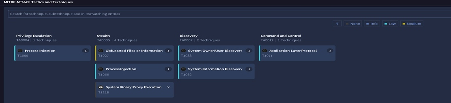

- **Privilege Escalation** — Process Injection (T1055)
- **Defense Evasion / Stealth** — Obfuscated Files or Information (T1027), Process Injection (T1055), System Binary Proxy Execution (T1218)
- **Discovery** — System Owner/User Discovery (T1033), System Information Discovery (T1082)
- **Command and Control** — Application Layer Protocol (T1071)

## Trigger and investigation start

The investigation began after downloading and executing a malicious `setup.exe` file, which stole passwords and credentials. Afterward, repeated alerts from endpoint protection (Malwarebytes) indicated periodic outbound network attempts from `MSBuild.exe` roughly every ten minutes.

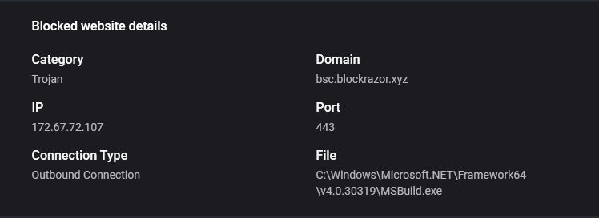

To validate locally, Security Event ID 4688 logging was used to track process creation, and Process Monitor was run to observe short-lived artifacts under `C:\Users\victim\AppData\Roaming\Microsoft\Crypto\`.

## Key findings

### Process creation evidence

Security Event ID 4688 recorded the creation of a new process for `C:\Windows\Microsoft.NET\Framework64\v4.0.30319\MSBuild.exe`.

The command line for this process was:

```
"C:\Windows\Microsoft.NET\Framework64\v4.0.30319\MSBuild.exe" "C:\Users\victim\AppData\Roaming\Microsoft\Crypto\FluentAssertions.csproj" /nologo /v:q
```

The same event showed `C:\Windows\System32\cmd.exe` as the parent process, indicating MSBuild was not started by Visual Studio or a normal build pipeline but via an explicit shell command.

A related 4688 event showed `conhost.exe` running in headless mode with the command line:

```
"C:\Windows\System32\conhost.exe" --headless cmd.exe /c "C:\Users\victim\AppData\Roaming\Microsoft\Crypto\indexer_f0c.cmd" /launched
```

Another event showed `cmd.exe` with:

```
"C:\Windows\System32\cmd.exe" /c "C:\Users\victim\AppData\Roaming\Microsoft\Crypto\indexer_f0c.cmd"
```

with `C:\Windows\explorer.exe` as the parent process.

From these events, the following process chain is derived:

```
explorer.exe -> cmd.exe -> conhost.exe -> MSBuild.exe -> FluentAssertions.csproj
```

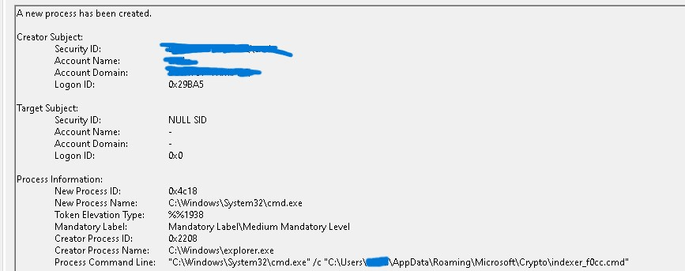

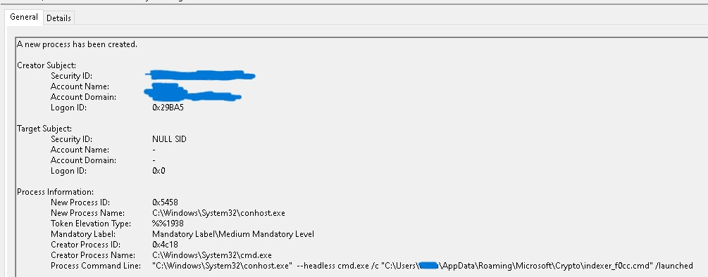

### File-system evidence

Process Monitor captured file activity under `C:\Users\victim\AppData\Roaming\Microsoft\Crypto\` for the following suspicious artifacts:

- `FluentAssertions.csproj`
- `FluentAssertions.csproj.user`
- `Build.targets`
- `Common.props`
- `indexer_f0c.cmd`

The presence of project, targets, props, and CMD launcher files inside the user `Crypto` folder is inconsistent with normal Visual Studio build workflows or standard Windows CryptoAPI usage.

These files appeared short-lived and were sometimes visible only in Process Monitor traces but not accessible on disk afterward, suggesting rapid deletion either by security tooling or by the malicious logic itself.

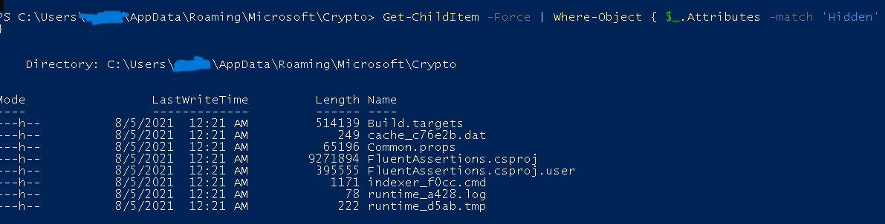

Later I was able to find the files using PowerShell, and after modifying a few registry keys I could also view them in the folder itself. Notably, the last-modified date had been self-modified by the attacker and did not reflect the actual date of last modification.

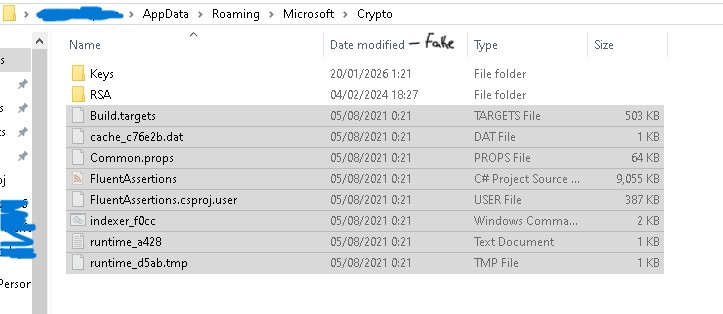

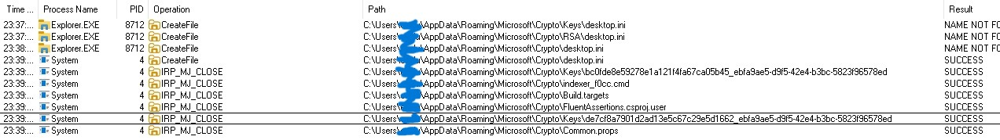

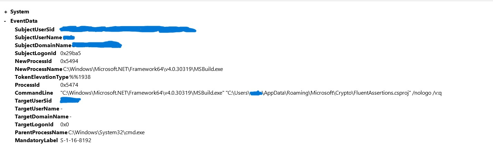

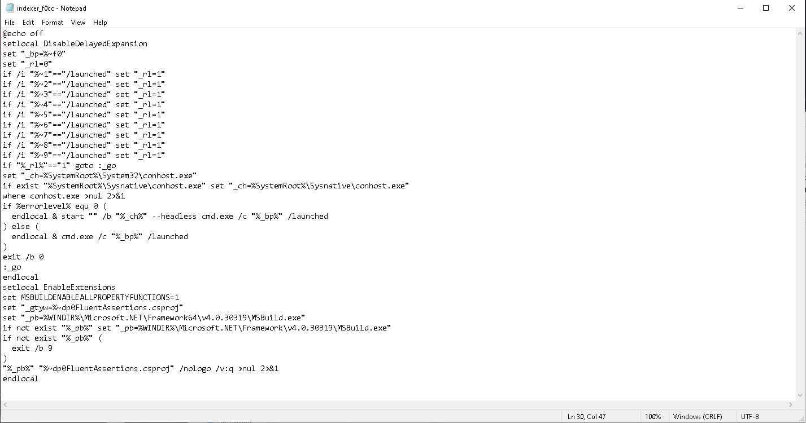

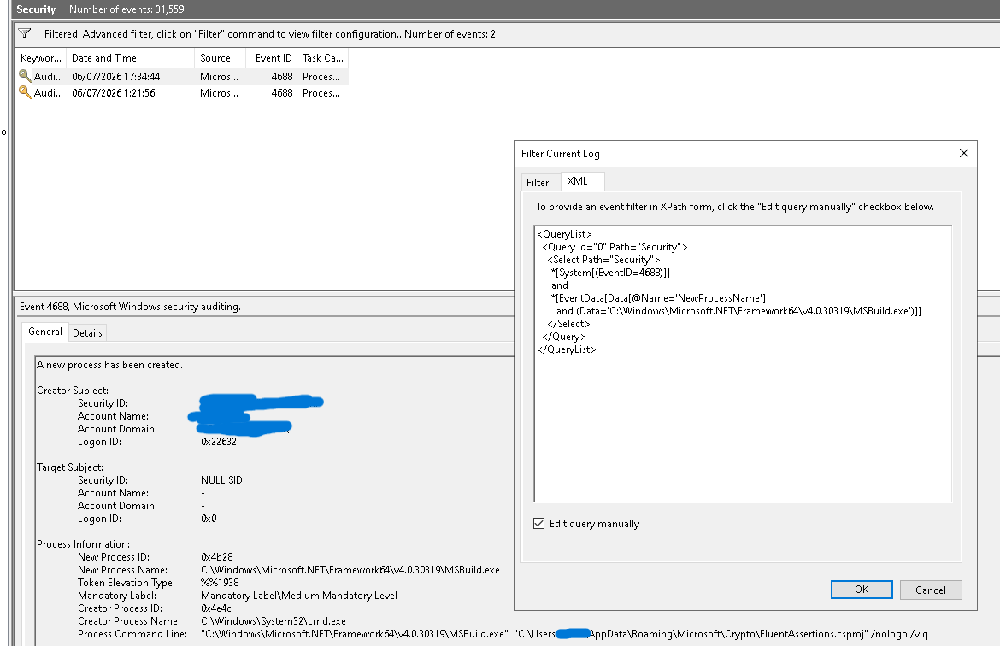

## Assessment

The strongest indicator of compromise is the fact that `MSBuild.exe` was executed against a `.csproj` file located under `AppData\Roaming\Microsoft\Crypto`, launched via `cmd.exe`, while the host generated recurring outbound connection attempts linked to that process.

This pattern aligns with documented MSBuild abuse techniques, where adversaries embed inline tasks or scripts inside project files to proxy code execution through a trusted, signed Microsoft binary.

The `indexer_f0c.cmd` file appears to serve as a staging/launcher script, while `Build.targets` and `Common.props` likely adjust or extend MSBuild behavior to reliably execute the malicious payload.

Given the lack of any legitimate reason to run such a project from a `Crypto` subfolder, this activity was treated as malicious.

## Investigation limitations

Although the suspicious files were observed in logs and Process Monitor traces, they were not consistently available on disk for collection, likely due to their transient nature.

Standard persistence checks (autoruns, Run keys, common Scheduled Tasks) did not reveal a clear startup entry, so the initial trigger for the process chain was not immediately identified.

After further investigation via `Win+R -> shell:startup`, a hidden startup file was found targeting `indexer_f0cc.cmd`, configured to start minimized to avoid detection.

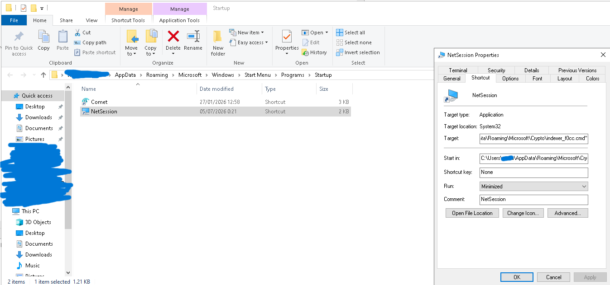

`indexer_f0cc.cmd` is the actual payload, used by MSBuild to compile it to its actual purpose.

### Indicators of Compromise (IOCs)

| Type | Value |
|---|---|
| Domain | [bsc.blockrazor.xyz](https://www.virustotal.com/gui/domain/bsc.blockrazor.xyz/) |
| File hash | [ee3fef1e0f65e7ea752ff7132780c31883a73e7d95a54221e016a258332db648](https://www.virustotal.com/gui/file/ee3fef1e0f65e7ea752ff7132780c31883a73e7d95a54221e016a258332db648/) |
| File hash | [35c0d18d80d81469725942e0bfe62db00f3796a735882f06e47b0e923fb72043](https://www.virustotal.com/gui/file/35c0d18d80d81469725942e0bfe62db00f3796a735882f06e47b0e923fb72043/) |

## Incident timeline

| Step | Observation |
|---|---|
| 1 | Repeated alerts about outbound connections from `MSBuild.exe`. |
| 2 | Event ID 4688 logs `MSBuild.exe` executing `FluentAssertions.csproj` from the user `Crypto` folder. |
| 3 | Event ID 4688 shows `cmd.exe` as parent of `MSBuild.exe`. |
| 4 | Event ID 4688 shows headless `conhost.exe` spawning `cmd.exe /c ...\indexer_f0c.cmd`. |
| 5 | Event ID 4688 shows `explorer.exe` as parent of `cmd.exe` that runs `indexer_f0c.cmd`. |
| 6 | Process Monitor shows transient `.csproj`, `.cmd`, `.targets`, and `.props` files under the user `Crypto` path. |

## Recommendations

**Immediate containment**
- Isolate the workstation from sensitive networks until there is high confidence that the transient project/script files are no longer being recreated.
- Preserve all logs, screenshots, and collected evidence for documentation and teaching/demo purposes.

**Targeted eradication**
- Delete any recurring instances of `FluentAssertions.csproj`, `FluentAssertions.csproj.user`, `Build.targets`, `Common.props`, and `indexer_f0c.cmd` from the user `Crypto` path when reachable on disk.
- Perform a broader search on the host for additional copies of these filenames or similarly structured MSBuild projects under `AppData`, `ProgramData`, and temporary directories.

**Hardening**
- Keep detailed process-creation logging with full command lines enabled to maintain visibility.
- Consider deploying Sysmon with a hardened configuration focused on detecting developer-tool abuse, including MSBuild executions with atypical parents or project paths.

## Conclusion

The collected evidence strongly supports a high-confidence assessment that the workstation experienced malicious MSBuild abuse, consistent with MITRE ATT&CK T1127.001.

Key artifacts include `FluentAssertions.csproj`, `FluentAssertions.csproj.user`, `Build.targets`, `Common.props`, and `indexer_f0c.cmd` under `C:\Users\victim\AppData\Roaming\Microsoft\Crypto\`, along with the process chain `explorer.exe -> cmd.exe -> conhost.exe -> MSBuild.exe`.
